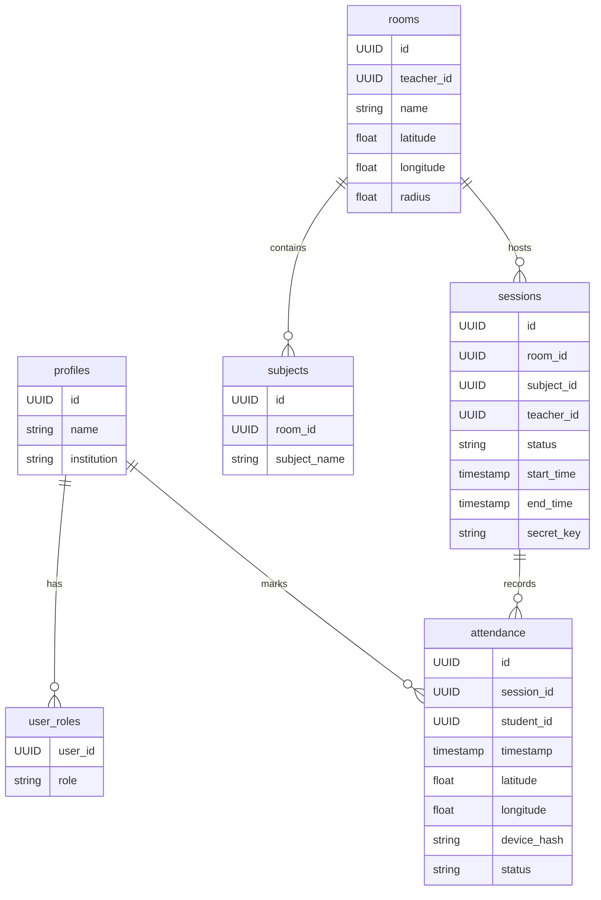
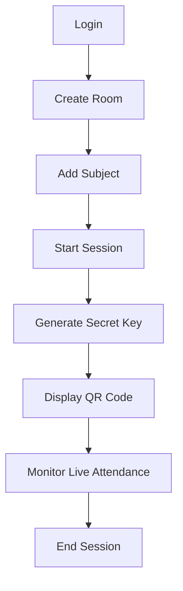
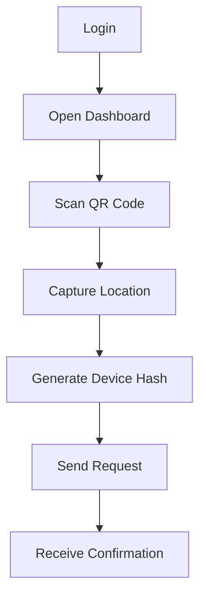
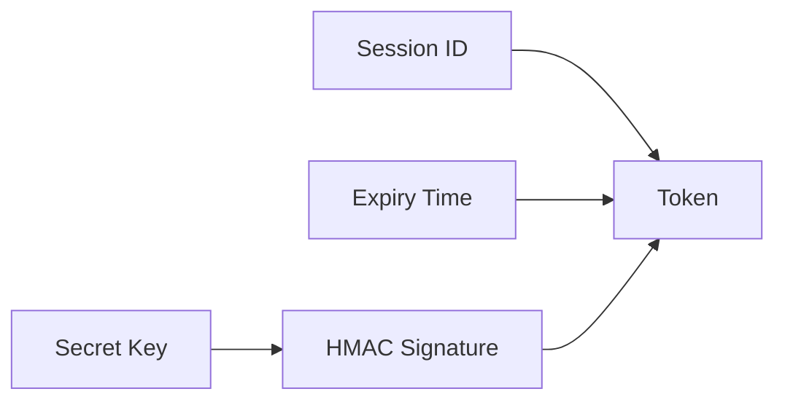
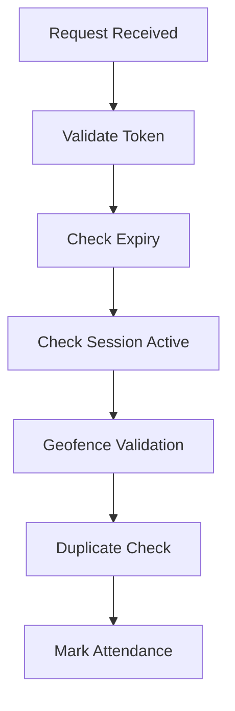
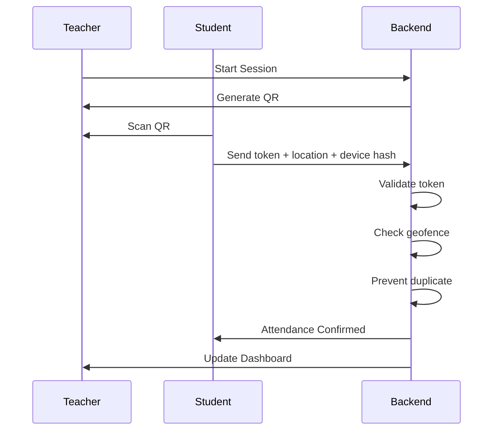

# Attendu — QR-Based Smart Attendance System

Attendu is a secure, real-time QR-based attendance system designed for classrooms. It ensures that attendance is recorded only when students are physically present within a defined geofence and time window.

---

## System Architecture

```mermaid
flowchart LR
    A[Frontend (React + TypeScript)] --> B[Backend (Supabase)]
    B --> C[PostgreSQL Database]
    B --> D[Auth System]
    B --> E[Realtime Engine]
    B --> F[Edge Functions]

    F --> G[HMAC Token Generation]
    F --> H[Attendance Verification]
    F --> I[Geofence Validation]

    A --> |QR Scan + Location + Device Hash| B
```

---

## Technology Stack

### Frontend
- React with TypeScript
- Vite
- Tailwind CSS
- html5-qrcode
- Geolocation API
- Device fingerprinting

### Backend
- Supabase (PostgreSQL, Auth, Realtime)
- Row Level Security (RLS)
- REST APIs / Edge Functions

### Edge Layer
- HMAC-based token generation
- Attendance verification
- Geofence validation (Haversine)

---

## Database Architecture



---

## Teacher Workflow



---

## Student Workflow



---

## QR Token System

- Refresh interval: 20 seconds
- Signed using HMAC



---

## Attendance Verification Flow



---

## System Workflow



---

## Security Highlights

- Short-lived QR tokens
- HMAC-based signatures
- Server-side validation
- Geofence enforcement
- Device fingerprint tracking
- Row Level Security (RLS)
- Role-based access control

---

## Key Advantages

- Prevents proxy attendance
- Location-restricted validation
- Time-bound QR tokens
- Real-time updates
- Scalable architecture

---

## License

MIT License
